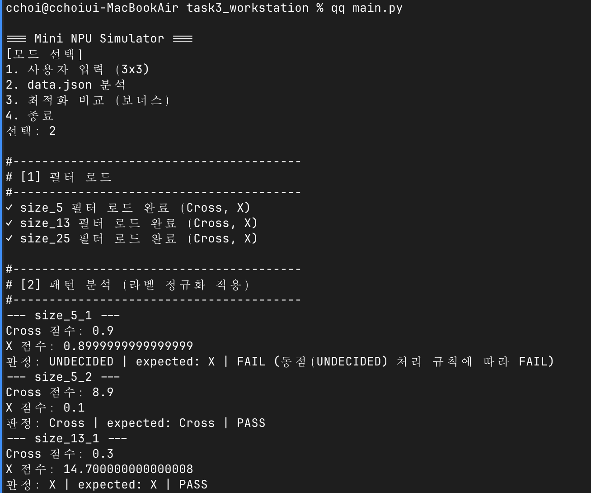
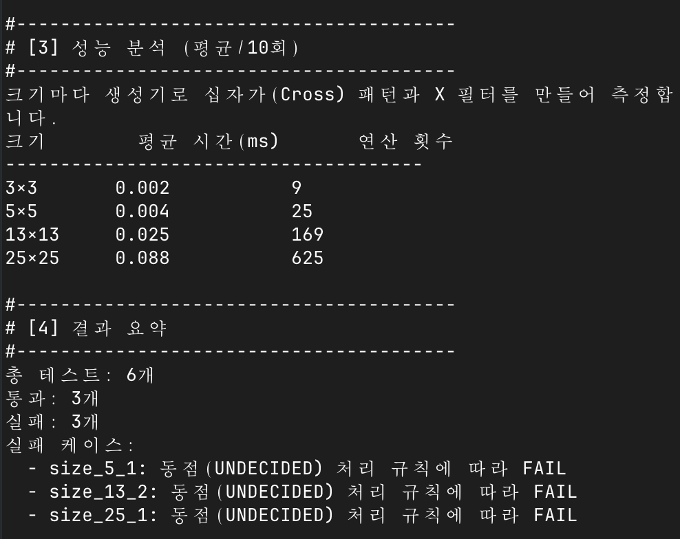
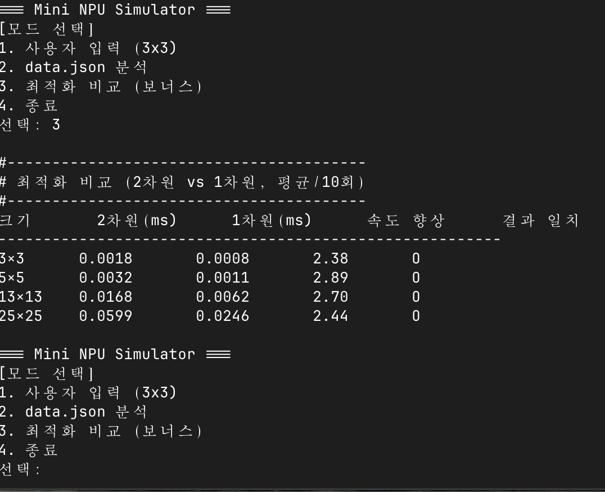
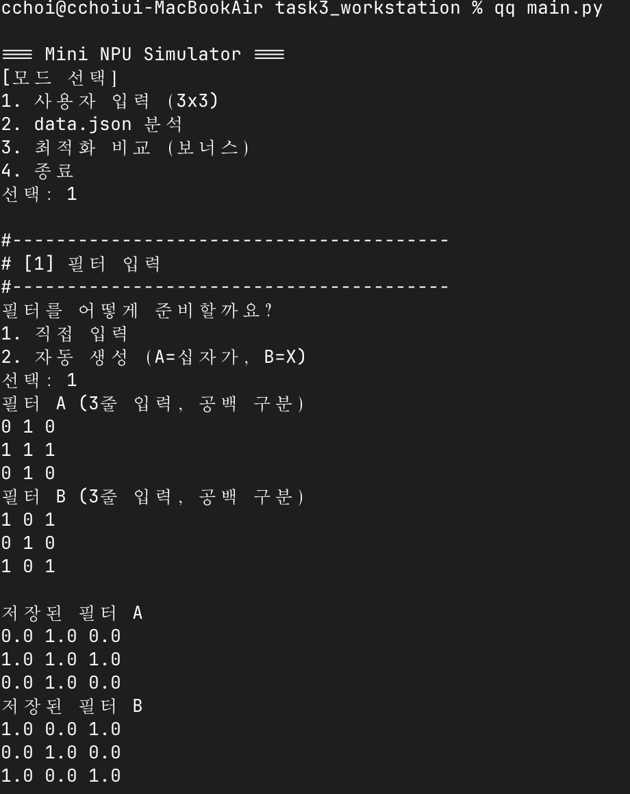
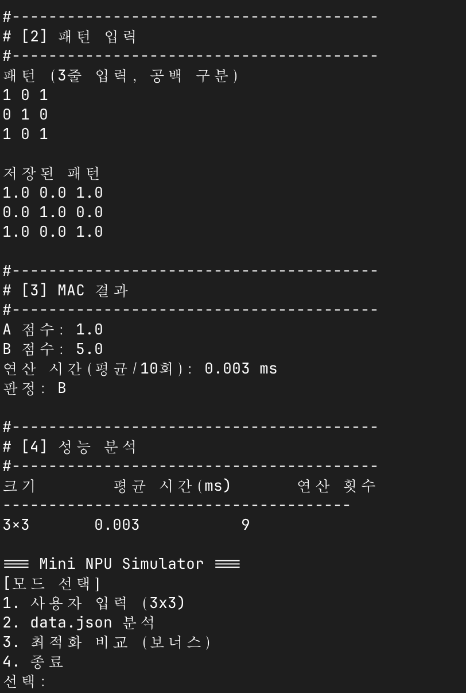

# Mini NPU 시뮬레이터 (Mini NPU Simulator)

MAC(Multiply-Accumulate) 연산으로 2차원 패턴이 십자가(Cross)인지 X인지 판별하는
Python 콘솔 프로그램입니다.

입력 패턴과 필터를 같은 위치끼리 곱해서 전부 더하면 점수가 나옵니다. 두 필터의 점수를
비교해 더 높은 쪽으로 판정합니다. NPU가 하는 계산을 반복문으로 흉내 낸 것입니다.

## 실행 방법

```bash
python3 main.py
```

Python 3.8 이상이면 됩니다. 외부 라이브러리는 쓰지 않았고 표준 라이브러리
(`json`, `time`)만 사용합니다. 따로 설치할 것이 없습니다.

실행하면 메뉴가 나옵니다.

```
=== Mini NPU Simulator ===
[모드 선택]
1. 사용자 입력 (3x3)
2. data.json 분석
3. 최적화 비교 (보너스)
4. 종료
```

- **1번** — 3×3 필터 A, B와 패턴을 한 줄씩 공백으로 구분해 입력합니다.
  필터는 직접 입력하는 대신 **생성기로 자동 생성**(A=십자가, B=X)할 수도 있습니다.
- **2번** — `data.json`을 읽어 5×5, 13×13, 25×25 케이스를 일괄 판정합니다.
- **3번** — 보너스. 2차원 방식과 1차원 방식의 연산 속도를 비교합니다.
- `Ctrl+C`, `Ctrl+D`로 중단해도 오류 없이 종료됩니다.

`data.json`은 **프로젝트 루트**(`main.py`와 같은 폴더)에 있어야 합니다.
파일이 없거나 내용이 깨진 경우 안내 메시지를 출력하고 메뉴로 돌아갑니다.

## 파일 구조

```
task3_workstation/
├── main.py         # 메인 실행 파일
├── data.json       # 필터와 패턴 데이터 (과제 제공)
├── screenshots/    # 실행 화면 캡처
├── .gitignore
└── README.md
```

## 실행 화면

모드 2 (data.json 분석) — 필터 로드와 패턴 판정



같은 실행의 성능 분석과 결과 요약



모드 3 (보너스) — 2차원과 1차원 방식 성능 비교



모드 1 (사용자 입력) — 필터 A, B 입력과 저장 확인



같은 실행의 MAC 결과와 판정



## 구현 요약

### 데이터 구조

`Matrix` 클래스가 n×n 배열을 담습니다. 2차원 리스트를 들고 있고 `get(row, col)`,
`set(row, col, value)`로 특정 위치의 값을 읽고 씁니다. 과제 요구사항인 "특정 위치의
값을 저장하고 읽어올 수 있어야 한다"를 이 두 메서드로 만족시킵니다.

`is_square()`로 행마다 길이가 `size`와 같은지 검사해서, 들쭉날쭉한 배열이 MAC 연산에
들어가 `IndexError`로 죽는 일을 막습니다. `show()`는 입력받은 행렬을 확인용으로
출력합니다.

보너스에는 같은 n×n을 1차원 리스트 하나에 펼쳐 담는 `FlatMatrix`가 따로 있습니다.
두 클래스는 **일부러 다른 방식**을 씁니다. `Matrix`는 `get()`으로 저장 방식을 감싸고,
`FlatMatrix`는 `data`를 그대로 노출해서 `mac_flat()`이 `data[i]`로 직접 읽게 합니다.

감싸는 쪽이 대체로 낫지만, `FlatMatrix`는 애초에 **접근 비용을 줄이려고** 만든
클래스입니다. 값 하나 꺼낼 때마다 메서드를 거치면 줄이려던 비용이 그대로 돌아오기
때문에, 여기서만 감싸기를 포기했습니다. 추상화와 최적화가 부딪히는 자리라 한쪽을
골라야 했고, 클래스마다 목적에 맞는 쪽을 택했습니다.

### 호출되는 곳이 없는 메서드 — `Matrix.set`

코드를 읽다 보면 `Matrix.set()`을 부르는 곳이 한 군데도 없다는 걸 알게 됩니다.
지우지 않고 남겨둔 것이라 이유를 적어둡니다.

**과제 요구사항이기 때문입니다.** 「4. 기능 요구 사항 → 1. 데이터 구조」에 이렇게
되어 있습니다.

```
n×n 크기의 2차원 패턴 및 필터를 저장할 수 있어야 한다.
특정 위치의 값을 저장하고 읽어올 수 있어야 한다.      ← 이 줄
최소 3×3, 5×5, 13×13, 25×25 크기를 처리할 수 있어야 한다.
```

`get`이 "읽어올", `set`이 "저장하고"에 해당합니다.

호출되지 않는 이유는 이 프로그램의 흐름 때문입니다. `make_cross`, `ask_matrix`,
`load_filters`가 행렬을 **완성된 상태로** 만들어서 넘기고, `mac()`은 읽기만 합니다.
만든 뒤에 값을 고칠 일이 없는 구조라 자연히 부를 데가 없습니다.

패턴의 특정 칸만 바꿔서 판정이 어떻게 달라지는지 보는 기능을 넣는다면 그때 쓰입니다.

### 반대로, 일부러 만들지 않은 메서드 — `FlatMatrix`의 접근자

`FlatMatrix`에는 `get`/`set`을 두지 않았습니다. 위와 정반대 판단이라 헷갈리기 쉬워
같이 적습니다.

이쪽은 **요구사항이 아닙니다.** 요구사항의 데이터 구조는 `Matrix`가 이미 만족시키고,
`FlatMatrix`는 보너스로 성능을 비교하려고 만든 클래스입니다.

그리고 만들면 오히려 해롭습니다. `get()`을 만들어두면 다음에 코드를 보는 사람이
"있으니까 쓰라는 것"으로 여기고 쓰게 되는데, 쓰는 순간 메서드 호출 비용이 되살아나
최적화가 사라집니다. **에러도 안 나고 결과도 맞아서 아무도 눈치채지 못합니다.**
25×25 한 번 계산에 값을 1250번 꺼내니 호출이 1250번 늘어납니다.

아예 없으면 `data`를 직접 읽는 수밖에 없고, 그게 이 클래스의 사용법입니다.

정리하면 두 판단의 기준이 다릅니다.

| | `Matrix.set` | `FlatMatrix`의 접근자 |
|---|---|---|
| 요구사항인가 | **그렇다** | 아니다 (보너스) |
| 지금 쓰이나 | 안 쓰인다 | — |
| 왜 이렇게 했나 | 요구사항이라 **만들어 뒀다** | 쓰면 최적화가 사라져서 **만들지 않았다** |

### MAC 연산

```python
def mac(pattern, filter_matrix):
    score = 0.0
    for row in range(pattern.size):
        for col in range(pattern.size):
            score += pattern.get(row, col) * filter_matrix.get(row, col)
    return score
```

이중 반복문으로 모든 칸을 훑으며 같은 위치끼리 곱하고 누적합니다. 외부 라이브러리를
쓰지 않고 반복문으로 직접 구현했습니다. N×N 배열이면 곱셈이 정확히 N²번 일어납니다.

### 라벨 정규화

파일에 적힌 표기가 제각각입니다. `expected`는 `'+'`와 `'x'`로, 필터 키는 `'cross'`와
`'x'`로 되어 있습니다. 프로그램 내부에서는 표준 라벨 `Cross`, `X` 두 가지만 씁니다.

```python
LABEL_MAP = {"+": CROSS, "cross": CROSS, "x": X}

def normalize_label(raw):
    text = str(raw).strip().lower()
    return LABEL_MAP.get(text)
```

대응표를 딕셔너리로 두고, 앞뒤 공백을 없애고 소문자로 바꾼 뒤 찾습니다. 표에 없는
값이면 `None`을 돌려주고, 그 케이스만 실패로 처리합니다.

입력에 따른 결과는 다음과 같습니다.

| 입력 | 결과 | 비고 |
|------|------|------|
| `"+"` | `Cross` | expected에 쓰이는 표기 |
| `"cross"` | `Cross` | 필터 키에 쓰이는 표기 |
| `"x"` | `X` | expected와 필터 키 양쪽 |
| `" X "` | `X` | 앞뒤 공백 제거 후 소문자 변환 |
| `"CROSS"` | `Cross` | 대소문자 무시 |
| `"o"` | `None` | 표에 없는 값 |

정규화에 실패하면 그 케이스는 아래처럼 처리됩니다.

```
--- size_5_3 ---
FAIL (알 수 없는 expected 값: o)
```

프로그램은 중단되지 않고 다음 케이스로 넘어갑니다.

정규화를 하지 않으면 `'Cross' == '+'`가 거짓이라 정상 케이스까지 전부 FAIL이 됩니다.
판정 출력과 PASS/FAIL 비교는 모두 표준 라벨을 기준으로 합니다.

### 동점 처리 정책 (epsilon)

두 점수를 `>`로 그냥 비교하지 않고 차이의 절댓값이 `1e-9`보다 작으면 동점으로 봅니다.

```python
EPSILON = 1e-9

def judge(score_a, score_b, label_a, label_b):
    if abs(score_a - score_b) < EPSILON:
        return UNDECIDED
    if score_a > score_b:
        return label_a
    return label_b
```

컴퓨터는 소수를 2진수로 저장하기 때문에 정확히 표현되지 않는 값이 있습니다.
`0.1 + 0.2`가 `0.30000000000000004`가 되는 것이 그 예입니다. MAC은 곱셈과 덧셈을
N²번 반복하므로 이 오차가 누적됩니다. 그래서 "정확히 같은가"가 아니라 "무시할 만큼
가까운가"로 판단해야 합니다.

동점 검사를 `>` 비교보다 **먼저** 하는 것이 중요합니다. 순서가 바뀌면 오차 수준의
차이로 승패가 갈려버립니다.

**`1e-9`을 고른 이유**는 과제에서 권장한 기준값이기도 하고, 실제 측정한 오차 규모와
비교했을 때 적절했기 때문입니다. `data.json`에서 동점으로 판정된 세 케이스의 점수
차이는 `1.1e-16`, `2.7e-15`, `1.8e-15`로 모두 `1e-15` 안팎이었습니다. 반면 점수가
확실히 갈린 케이스는 차이가 8.8 이상이었습니다. **오차 수준과 유의미한 차이 사이가
크게 벌어져 있어**, 그 사이 어디에 기준을 두어도 판정 결과는 같습니다.

기준값을 바꾸면 이렇게 달라집니다.

| EPSILON | 결과 |
|---------|------|
| `1e-9` (현재) | 오차 수준의 차이를 동점으로 처리 |
| `0` 또는 미적용 | 오차의 우연한 부호에 따라 승패가 갈림 |
| `1.0` 처럼 큰 값 | 의미 있는 차이까지 동점으로 묶여 판정 자체가 무의미해짐

### 모드별 동점 처리 비교

판정 로직은 두 모드가 공유하고, 그 결과를 쓰는 방식만 다릅니다.

| | 모드 1 (사용자 입력) | 모드 2 (data.json) |
|---|---|---|
| 비교 함수 | `judge()` 동일 | `judge()` 동일 |
| 넘기는 라벨 | `A`, `B` | `Cross`, `X` |
| 동점일 때 출력 | `판정 불가 (\|A-B\| < 1e-09)` | `UNDECIDED` |
| 그 뒤 처리 | 안내하고 종료 | FAIL로 집계 |
| 이유 | 정답이 없어 맞고 틀림을 따질 대상이 없음 | `expected`가 있어 비교가 가능함 |

`judge()`가 라벨을 인자로 받도록 만들었기 때문에 함수 하나로 두 모드를 모두
처리합니다. 동점 기준(`EPSILON`)이 한 곳에만 있어 기준을 바꾸면 양쪽에 동시에
반영됩니다.

### 입력 검증과 스키마 검증

모드 1은 각 줄의 숫자 개수와 파싱 가능 여부를 검사하고, 문제가 있으면 안내 문구를
출력한 뒤 처음부터 다시 받습니다.

모드 2는 케이스마다 여섯 단계를 검사합니다. 키에서 크기를 읽을 수 있는지, 해당 크기의
필터가 있는지, Cross와 X가 모두 있는지, `input` 항목이 있는지, 정사각형인지,
필터와 크기가 일치하는지입니다. 어느 하나라도 실패하면 그 케이스만 FAIL로 기록하고
사유를 남긴 뒤 다음 케이스로 넘어갑니다. 프로그램이 중단되지 않습니다.

### 패턴 키에서 필터를 찾아가는 순서

키 이름 자체가 크기 정보를 담고 있다는 점을 이용했습니다.

```
patterns 키 :  "size_13_1"
                    ↓  split("_")  →  ['size', '13', '1']
                    ↓  두 번째 조각을 int()
크기        :  13
                    ↓  filters[13] 조회
필터        :  {"Cross": Matrix, "X": Matrix}
```

`filters`는 로드 시점에 이미 정규화된 형태로 바뀌어 있습니다.

```
파일  :  {"size_5": {"cross": [[...]], "x": [[...]]}}    문자열 키, 소문자 라벨
             ↓ load_filters()
내부  :  {5: {"Cross": Matrix, "X": Matrix}}             숫자 키, 표준 라벨
```

한 번 변환해두면 이후에는 `filters[size][CROSS]`로 바로 꺼내 쓸 수 있습니다.
케이스마다 문자열을 조립할 필요가 없습니다.

키 형식이 이상하면 `size_from_key()`가 `None`을 돌려주고, 그 케이스만 FAIL로
기록됩니다.

```
--- 잘못된키_1 ---
FAIL (키에서 크기를 읽을 수 없음)
```

### 새로운 라벨을 추가하려면

`data.json`에 `'o'`(원) 같은 라벨이 추가되는 상황을 가정하면, 아래 순서로
확장하면 됩니다.

| 순서 | 할 일 | 파일 위치 |
|------|-------|-----------|
| 1 | 표준 라벨 상수 추가 (`CIRCLE = "Circle"`) | 상수 정의부 |
| 2 | `LABEL_MAP`에 표기 추가 (`"o": CIRCLE`) | 상수 정의부 |
| 3 | 판정 로직을 2개 비교에서 최댓값 찾기로 변경 | `judge()` |
| 4 | 필터 존재 검사를 라벨 목록 기반으로 변경 | `analyze_case()` |
| 5 | 점수 출력을 반복문으로 변경 | `print_case()` |
| 6 | 새 케이스를 넣어 테스트, 기존 6건 회귀 확인 | `data.json` |

1~2단계는 표에 한 줄씩 추가하면 끝나므로 `normalize_label()` 자체는 고칠 필요가
없습니다. 정규화를 별도 함수와 대응표로 분리해둔 효과입니다.

가장 큰 변경은 3단계입니다. 현재 `judge()`는 두 점수를 비교하는 구조라
라벨이 셋 이상이면 최댓값을 찾는 방식으로 바꿔야 합니다. 동점 판정도
"두 점수의 차이"에서 "최고점과 오차 이내인 라벨이 몇 개인가"로 달라집니다.

## 결과 리포트

### 판정 결과

`data.json` 6개 케이스 중 **통과 3개, 실패 3개**입니다.

| 케이스 | Cross 점수 | X 점수 | 차이 | 판정 | expected | 결과 |
|---|---|---|---|---|---|---|
| size_5_1 | 0.9 | 0.8999999999999999 | 1.1e-16 | UNDECIDED | X | FAIL |
| size_5_2 | 8.9 | 0.1 | 8.8 | Cross | Cross | PASS |
| size_13_1 | 0.3 | 14.700000000000008 | 14.4 | X | X | PASS |
| size_13_2 | 7.499999999999997 | 7.5 | 2.7e-15 | UNDECIDED | Cross | FAIL |
| size_25_1 | 4.9 | 4.899999999999999 | 1.8e-15 | UNDECIDED | X | FAIL |
| size_25_2 | 52.9 | 0.1 | 52.8 | Cross | Cross | PASS |

### 실패 원인 분석

실패한 세 케이스는 모두 같은 이유입니다. 두 필터의 점수 차이가 `1e-15` 수준이라
epsilon 정책에 따라 동점(UNDECIDED)으로 판정됐고, `expected`와 다르므로 FAIL이
됐습니다.

원인을 세 가지로 나눠 확인했습니다. 첫째, 데이터/스키마 문제는 아닙니다. 키 형식과
크기가 모두 일치했고 스키마 검증 여섯 단계를 전부 통과했습니다. 둘째, 로직 문제도
아닙니다. 점수가 확실히 갈리는 세 케이스는 정확히 맞혔고, 3×3 예시(십자가×십자가=5,
십자가×X=1)도 손계산과 일치합니다. 셋째, 남는 것은 수치 비교 문제입니다.

표의 차이 열을 보면 중간값이 없습니다. 통과한 케이스는 8.8, 14.4, 52.8로 압도적이고
실패한 케이스는 소수점 15자리 아래에서만 다릅니다. 이는 실패 케이스의 두 점수가
수학적으로는 정확히 같도록 데이터가 설계됐다는 뜻입니다. `size_5_1`을 예로 들면
X 필터 쪽은 값 `0.1`이 9칸 겹쳐 `0.1`을 아홉 번 더한 값이고, Cross 필터 쪽은 중앙
한 칸의 `0.9`뿐입니다. 수학적으로 둘 다 0.9지만, 아홉 번 더한 쪽에 오차가 쌓여
`0.8999999999999999`가 됩니다.

epsilon 없이 `>`로만 비교하면 어떻게 되는지도 확인해봤습니다. 실패 개수는 똑같이
3개지만 판정 내용이 달라집니다. `size_5_1`은 Cross로, `size_13_2`는 X로 판정됩니다.
어느 쪽으로 갈릴지가 부동소수점 오차의 우연한 부호에 달려 있는 셈입니다. epsilon을
적용하면 "이건 동점이라 판정할 수 없다"고 정직하게 표시됩니다. 결과는 같은 FAIL이지만
전자는 우연이고 후자는 판단입니다.

즉 이 세 FAIL은 고쳐야 할 버그가 아니라, 동점을 UNDECIDED로 처리하기로 한 정책의
정상적인 결과입니다. 만약 통과시키려면 정책 자체를 바꿔야 합니다. 예를 들어 동점일 때
특정 라벨을 우선하도록 규칙을 정하는 방법이 있지만, 근거 없는 판정을 만들어내는
것이라 이 과제의 취지에 맞지 않는다고 판단했습니다.

### 성능 표와 시간 복잡도

측정은 각 크기마다 MAC 연산만 10회 반복해 평균을 냈습니다(아래 표는 값을 안정시키려고
200회로 측정). 파일 읽기나 출력은 측정 구간에서 제외했습니다.

| 크기 | 연산 횟수 (N²) | 평균 시간 (ms) | 곱셈 1회당 |
|---|---|---|---|
| 3×3 | 9 | 0.0007 | 0.077 µs |
| 5×5 | 25 | 0.0017 | 0.070 µs |
| 13×13 | 169 | 0.0097 | 0.057 µs |
| 25×25 | 625 | 0.0325 | 0.052 µs |

맨 오른쪽 열이 크기와 무관하게 거의 일정합니다. 곱셈 한 번에 드는 시간은 배열이 커져도
변하지 않고, 총 시간은 곱셈 횟수에 비례한다는 뜻입니다. `mac()`의 이중 반복문이
N행 × N열을 도니 곱셈 횟수는 N²이고, 따라서 시간 복잡도는 O(N²)입니다.

13×13에서 25×25로 갈 때를 보면 근거가 분명합니다. 크기는 1.92배지만 연산 횟수는
3.70배(1.92²)로 늘고, 실제 측정 시간도 3.35배 늘었습니다. 예측과 거의 일치합니다.
크기가 2배가 되면 시간은 4배가 된다는 것이 O(N²)의 의미입니다.

3×3만 곱셈 1회당 시간이 조금 높게 나오는데, 계산이 워낙 짧아서 함수를 호출하고
반복문을 준비하는 고정 비용이 상대적으로 크게 잡히기 때문입니다. 배열이 커질수록
이 비중이 줄어 값이 안정됩니다.

## 대규모 데이터에서의 한계와 최적화

### 1000×1000 패턴이면 무엇이 문제가 되나

현재 구현은 3×3부터 25×25까지를 전제로 만들었습니다. 크기를 1000으로 올리면
아래처럼 달라집니다.

| 항목 | 25×25 | 1000×1000 | 배수 |
|------|-------|-----------|------|
| 연산 횟수 (N²) | 625 | 1,000,000 | 1600배 |
| MAC 1회 시간 (측정값 기준 추정) | 0.033 ms | 약 52 ms | — |
| 패턴 하나의 메모리 | 약 5 KB | 약 8 MB | 1600배 |

**시간이 먼저 문제가 됩니다.** MAC 1회에 약 50ms가 걸리면, 케이스 6개에 필터를
두 개씩 적용할 때 0.6초입니다. 여기에 성능 측정을 10회 반복하면 수 초 단위로
늘어납니다.

**메모리는 파이썬 특성 때문에 예상보다 큽니다.** 파이썬의 `float` 객체 하나가
약 24바이트를 차지하므로 100만 개면 24MB이고, 리스트가 각 객체를 가리키는
포인터까지 더하면 30MB를 넘습니다. 패턴과 필터를 여러 개 동시에 올리면
수백 MB에 이릅니다.

### 최적화 우선순위

효과가 크고 적용이 쉬운 순서로 정리했습니다.

**1순위 — 1차원 배열과 단일 반복문 (이미 구현)**

보너스로 만든 `FlatMatrix` 와 `mac_flat()` 이 여기 해당합니다. 이중 반복문을
단일 반복문으로 바꾸고 `get()` 메서드 호출을 없앴습니다. 25×25 기준으로
2.4~3.0배 빨라졌고, 1000×1000이면 **메서드 호출 200만 번이 사라집니다.**
구조를 크게 바꾸지 않고 얻는 이득이라 가장 먼저 적용할 항목입니다.

**2순위 — 0인 칸 건너뛰기**

```python
if pattern.data[i] == 0:
    continue
```

Cross나 X 같은 필터는 대부분의 칸이 0입니다. 1000×1000 십자가는 100만 칸 중
약 2000칸만 0이 아니므로 **99.8%를 건너뛸 수 있습니다.** 다만 조건 검사 비용이
추가되므로, 0이 적은 데이터에서는 오히려 느려집니다. 데이터 성격을 확인하고
적용해야 합니다.

**3순위 — 희소 표현(sparse)으로 저장**

0이 아닌 위치만 `{(행, 열): 값}` 형태로 저장하면 메모리 사용량이 크게 줄고
순회 대상도 함께 줄어듭니다. 2순위보다 구조 변경이 크고 `Matrix` 클래스의
인터페이스를 다시 설계해야 합니다.

**4순위 — 벡터화 라이브러리**

NumPy처럼 C로 구현된 연산을 쓰면 수십 배 빨라집니다. 다만 이 과제는 외부
라이브러리 사용이 금지되어 있습니다. 반복문으로 직접 구현해 O(N²)를 체감하는
것이 학습 목표이기 때문입니다.

**복잡도 자체는 바뀌지 않습니다.** 1~4순위 모두 상수 배 개선이며 여전히 O(N²)
입니다. 곱셈 횟수를 줄이려면 알고리즘을 바꿔야 하는데, 이 문제는 모든 칸을
확인해야 하므로 N² 아래로 내려가기 어렵습니다.

### CPU와 NPU에서 병목이 생기는 지점

**MAC 연산의 성질부터 보면 이유가 분명해집니다.**

```python
score += pattern[i] * filter[i]
```

칸마다 하는 일은 곱셈 하나와 덧셈 하나뿐입니다. 그리고 **칸끼리 서로 의존하지
않습니다.** 5번 칸을 계산하려고 3번 칸의 결과를 기다릴 필요가 없습니다.

**CPU의 병목은 연산 처리량입니다.** CPU는 복잡한 명령을 순서대로 처리하도록
설계되어 있습니다. 분기 예측, 캐시, 파이프라인 같은 정교한 장치를 갖추고 있지만
**동시에 처리할 수 있는 연산의 개수가 적습니다.** 1000×1000이면 100만 번을
사실상 차례로 처리하는데, 각 연산이 워낙 단순해서 CPU의 정교한 기능이 도움이
되지 않습니다. 성능이 "얼마나 많이 동시에 처리하는가"에 좌우되는데 CPU는 그
부분이 약합니다.

파이썬에서는 여기에 인터프리터 오버헤드가 더해집니다. 반복문을 한 바퀴 돌 때마다
타입 확인과 객체 참조 같은 부가 작업이 붙어서, 실제 곱셈보다 준비 비용이 더 큽니다.
1순위 최적화(메서드 호출 제거)가 효과를 낸 이유가 이것입니다.

**NPU는 MAC 전용 연산기를 수천 개 나란히 두고 한 번에 처리합니다.** 칸끼리
독립적이라 순서를 지킬 필요가 없으므로 병렬화가 잘 들어맞습니다. CPU가 100만 번을
차례로 처리할 것을 NPU는 수천 개씩 묶어 처리합니다.

**다만 병목이 사라지는 것이 아니라 옮겨갑니다.**

| | 병목 | 이유 |
|---|------|------|
| CPU | 연산 처리량 | 동시에 처리할 수 있는 연산 수가 적음 |
| NPU | 메모리 대역폭 | 연산기는 많은데 데이터를 그만큼 빨리 공급하지 못함 |

NPU는 연산기가 충분하므로, 이제는 **데이터를 얼마나 빨리 넣어주느냐**가 한계가
됩니다. 그래서 실제 NPU 설계에서는 한 번 읽은 값을 여러 연산에 재사용하는 방식과
메모리 배치가 중요해집니다.

**이 과제의 1차원 최적화도 같은 맥락입니다.** 2차원 리스트를 1차원으로 편 것은
데이터를 메모리에 연속으로 놓아 접근을 단순하게 만든 것이고, 이는 하드웨어가
데이터를 가져오는 비용을 줄이는 방향과 같습니다.

## 보너스 과제

### 1. 1차원 배열 최적화

`FlatMatrix`는 n×n을 길이 N²짜리 리스트 하나에 펼쳐 담습니다. 위치 계산은
`행 × 크기 + 열` 한 줄입니다. `mac_flat()`은 이 배열을 단일 반복문으로 훑습니다.

기존 방식과 비교하면 두 가지가 줄었습니다. 이중 반복문이 단일 반복문이 됐고,
`get()` 메서드 호출이 사라져 리스트에 직접 접근합니다. 25×25 기준으로 메서드 호출
1250번이 없어집니다.

| 크기 | 2차원 (ms) | 1차원 (ms) | 속도 향상 | 결과 일치 |
|---|---|---|---|---|
| 3×3 | 0.0007 | 0.0002 | 2.85배 | O |
| 5×5 | 0.0016 | 0.0005 | 2.95배 | O |
| 13×13 | 0.0091 | 0.0032 | 2.86배 | O |
| 25×25 | 0.0319 | 0.0131 | 2.44배 | O |

크기와 상관없이 2.4~3.0배 빨라집니다. 배수는 측정할 때마다 조금씩 달라지므로
정확한 값보다 "일관되게 빠르다"는 방향이 중요합니다. 상수 배 빨라진 것이고
시간 복잡도 자체는 여전히 O(N²)입니다. 곱셈 횟수는 그대로이기 때문입니다.

결과 일치 열은 두 방식의 점수가 같은지 확인한 것입니다. 빨라져도 답이 달라지면
최적화가 아니므로 함께 검증했습니다.

### 2. 패턴 생성기

`make_cross(size)`와 `make_x(size)`가 임의 크기의 십자가와 X 패턴을 만듭니다.
십자가는 가운데 행과 열(`row == mid or col == mid`), X는 두 대각선
(`row == col or row + col == size - 1`)에 1을 넣습니다.

`data.json`에는 5, 13, 25만 있어서 3×3 성능 측정에 쓸 데이터가 없었는데, 이 생성기로
만들어 썼습니다. 생성된 패턴은 세 군데에서 재활용합니다.

- **모드 1** — 필터 입력 단계에서 "자동 생성"을 고르면 A에 십자가, B에 X를 넣습니다.
  직접 입력은 그대로 남아 있고 자동 생성이 선택지로 하나 더 붙은 것입니다.
- **성능 분석** — 크기마다 십자가 패턴과 X 필터를 만들어 MAC 시간을 잽니다.
- **최적화 비교** — 같은 데이터를 2차원과 1차원 방식에 각각 넣어 비교합니다.

성능 측정에서 필터 안의 값은 결과에 영향을 주지 않습니다. MAC 시간은 크기 N에만
좌우되기 때문에, 같은 크기의 필터이기만 하면 됩니다. 그래서 생성기가 만든 Cross/X를
그대로 씁니다.

생성기를 쓴 자리에는 안내 문구를 출력해서, 화면만 봐도 어디서 생성된 데이터가
쓰였는지 알 수 있게 했습니다.

```
필터를 어떻게 준비할까요?
1. 직접 입력
2. 자동 생성 (A=십자가, B=X)
선택: 2
생성기로 3×3 십자가(Cross) 필터와 X 필터를 만들었습니다.
```

크기는 홀수여야 정확한 중앙이 생깁니다. 짝수면 십자가가 한쪽으로 치우칩니다.
과제에서 쓰는 3, 5, 13, 25가 모두 홀수인 이유이기도 합니다.
